# Septic App

**A septic-pump-out business, in one database.** An installable driver PWA (routes, arrival,
completion → the regulatory ledger) and an office web app (scheduling, billing, compliance,
accounts receivable) over one Postgres. Built to replace a Click-Once/Access
application — the domain rules below were learned from decades of paper and kept because the
paper taught them the hard way.

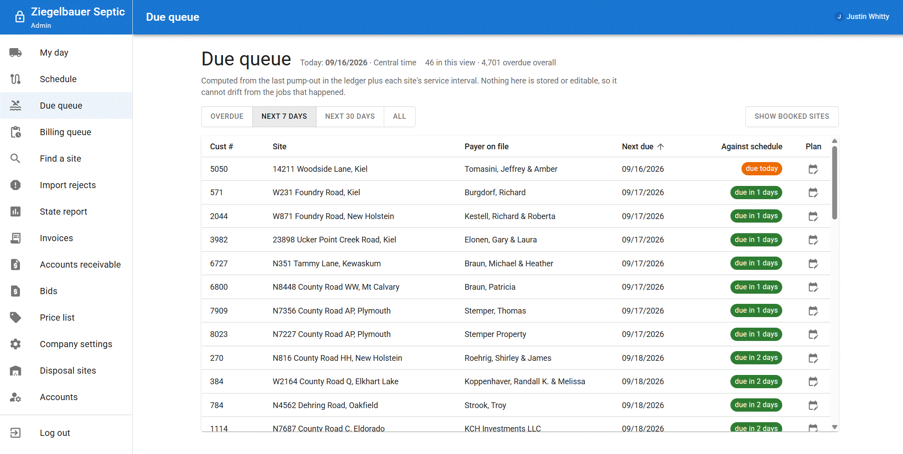

## What it does

**The driver's day.** The office builds a route; the driver's phone shows it — arrival,
completion, gallons, where the waste went, notes and photos — and every action queues locally
when there is no signal and replays idempotently when there is. The last stop resolved closes the
day on the screen, not on a refresh.

**The ledger.** Every completed stop is one append-only `service_events` row: who pumped it, what
tank, how much, and which **disposal site** it went to — because the state report is assembled per
site, and an event that cannot answer that question cannot be filed. Corrections are always new
rows, never edits.

**The book.** Invoices are assembled from the work actually done; a payment is a receipt row
(who took it, method, when) and the invoice's paid balance is re-summed from receipts, never
typed. Receivables are computed per request, so a stored balance can never drift. Overpayments
are refused by naming the balance; refunds are adjustment documents that link to the original.

**The paperwork.** Printed invoices and bids carry the company letterhead from one settings row;
the state's monthly disposal report is assembled from the ledger with one click.

| Office — finding work | Office — booking the truck |
|---|---|
| 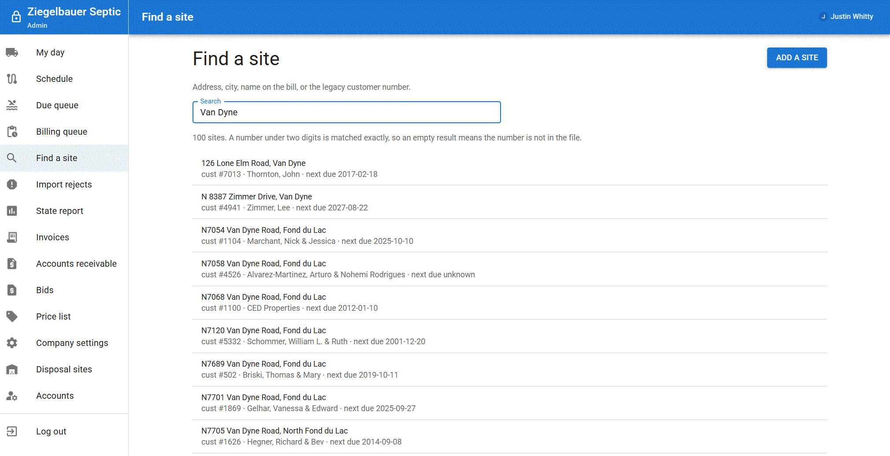 | 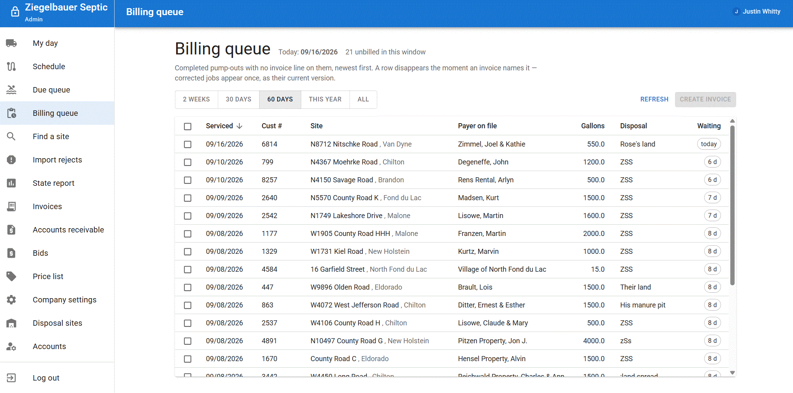 |
| By the number a crew would say out loud | Every completed stop that has no invoice yet |

| Office — the book | Office — the paperwork |
|---|---|
| 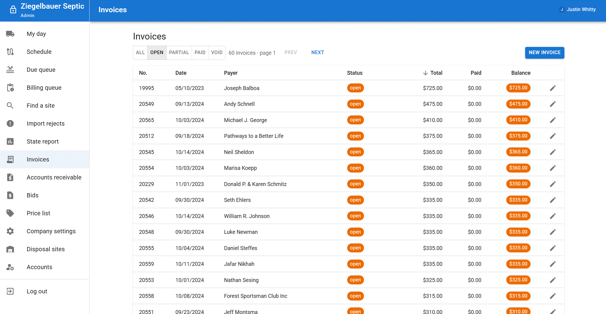 | 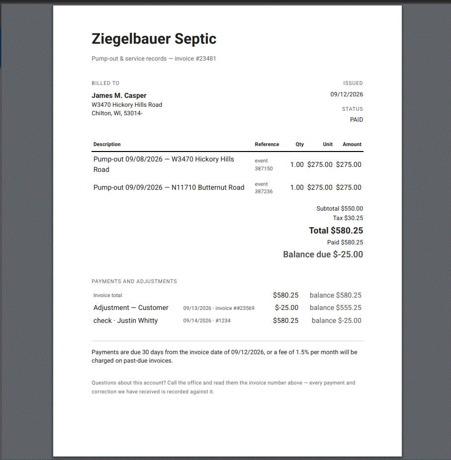 |
| The header, the lines, the receipts | One paper, printed from the ledger and the settings row |

| | |
|---|---|
| 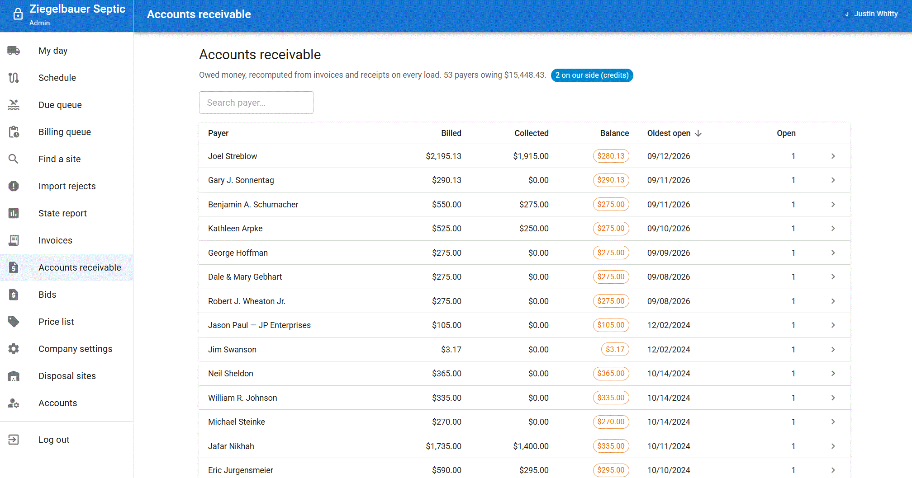 | 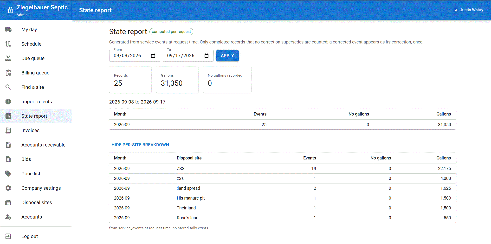 |
| Who owes what, and how late | The monthly filing, assembled per disposal site |

| | |
|---|---|
| 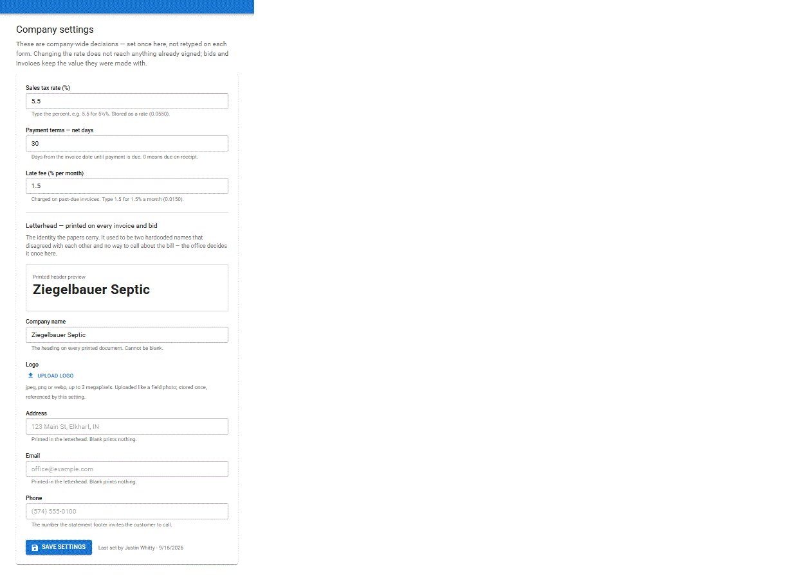 | 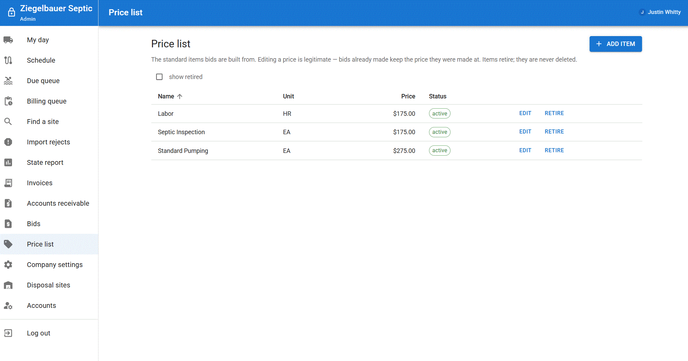 |
| Identity, tax, and terms — set once, printed everywhere | The catalog a bid line answers to ([bids](images/bids.gif), [printed bid](images/print_bid.gif), [adding a site](images/addsite.gif)) |

**On the phone.** The same PWA, driver role: the day's cards, the capture panel, and an offline
queue that survives a dead radio.

| | | | |
|---|---|---|---|
| 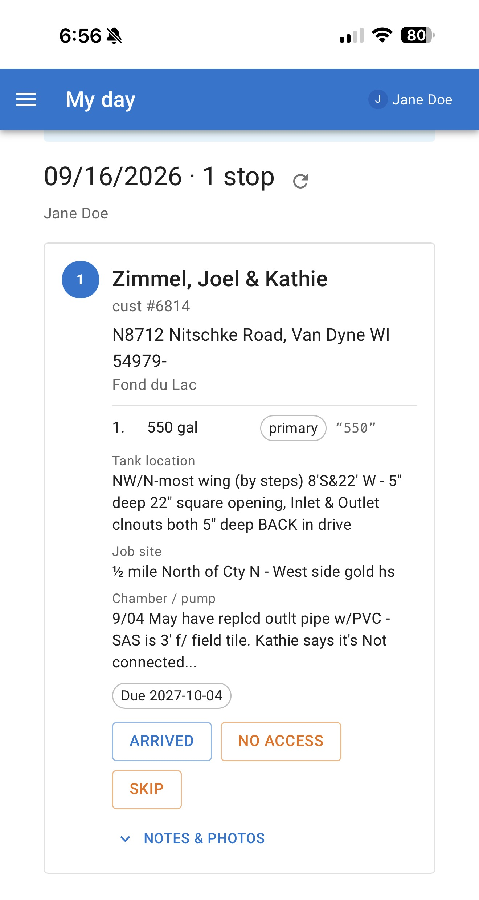 | 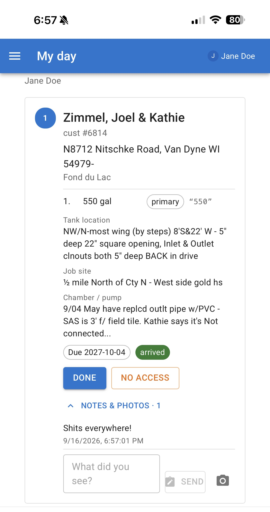 | 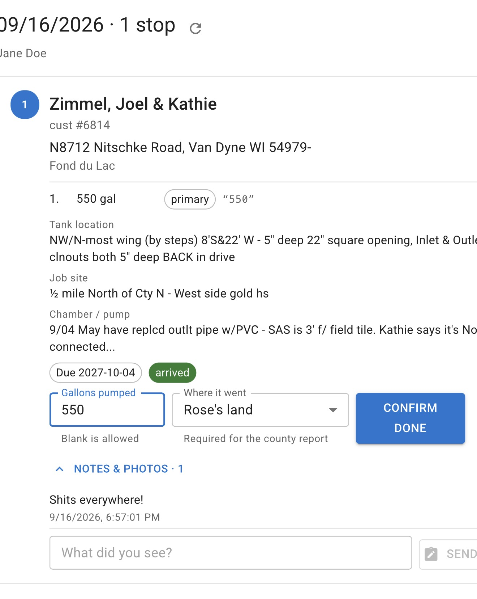 | 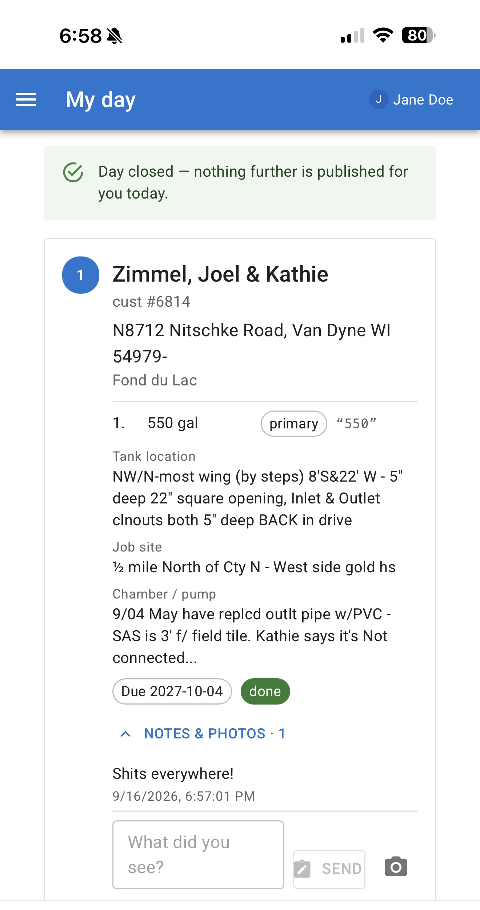 |

## How a day moves

```
 office                          driver (phone)                 database
 ──────                          ────────────────                 ────────
 Due queue  ── picks ──▶  Route composer ── publish ──▶  routes / route_stops
                                                            │
                         My day: cards arrive ◀──────────────┘
                             │ arrived → done | no_access | skipped
                             │ (gallons, waste type, disposal site, notes, photos)
                             ▼
                     offline outbox ── idempotent replay (client_uuid) ──▶  service_events
                     the day announces its own ending                          (append-only)
                                                                              │
 Billing queue  ◀── every unbilled event surfaces here ◀──────────────────────┘
     │ one click
     ▼
 invoices + lines ── payments (receipt rows) ──▶  accounts receivable
     │
     ▼
 state report, assembled per disposal site
```

The server owns every clock-written field: arrival and completion timestamps, service dates
(everything date-relative reads `business_today()`, never `now()`), and `completed_at` exists only
for `done`. A device never sends a date it made up.

## Why the rules are what they are

- **The ledger is append-only** (`service_events`, `payments`, `job_notes` refuse UPDATE/DELETE
  at the database itself, errcode 42501). History is corrected with new rows — adjustments link
  to the original, ownership changes close one row and open another with touching dates.
- **Money is never a float** (`numeric` everywhere), and `invoices.amount_paid` is re-summed from
  receipt rows on every write — a mutation test drifts the column on purpose and requires the sum
  to overwrite the drift.
- **The offline queue reads status codes as verdicts.** 400/404/409 = refused on its facts → drop
  and re-read the day (the server owns the day); 401/403 = refused on identity → park the queue,
  keep the work; 5xx/transport = undecided → back off and retry. A queued write never carries a
  version, because it is a late write and pinning a version throws away real work.
- **Migrations are immutable once applied.** Every applied file is sha256-recorded; editing one
  fails the build *by design*, so fixes move forward.
- **The documentation is under test.** `docs/REQUIREMENTS.md` is parsed by the jest suite: prose,
  status columns, and counts must agree with the code or CI goes red. The API route table in the
  backend README is checked both directions against the mounted routes.
- **Errors never leak schema.** "No disposal site has id 407", never a constraint name; every
  refusal names the thing the caller needs next.

## Stack

- **Backend** — Node, Express, TypeORM (entities only; the schema is versioned raw SQL),
  Postgres 16, S3/MinIO for photos.
- **Frontend** — one installable PWA: React, TypeScript, MUI, an IndexedDB outbox and a
  cache-first service worker (`septic-app/frontend/src/offline/`).
- **Everything in containers.** No host Node, no host Postgres.

## Quickstart

Prerequisites: Docker with Compose v2. That is all.

```bash
cp .env.example .env                  # set JWT_SECRET:  openssl rand -base64 48
docker compose up -d --build
docker compose exec backend npm run migrate
docker compose exec backend npm run seed:user -- \
  --email=you@company.example --role=admin --first=Avery --last=Owner --password='Pick-0ne-str0ng!'
```

Open **http://localhost:3000**, sign in, and go to **Company settings**: name, address, phone,
logo, sales tax, and payment terms live in one row that every printed document reads. Add your
disposal sites, and the app is ready to book its first day.

| Service | URL | Notes |
|---|---|---|
| Frontend (PWA) | http://localhost:3000 | proxies `/api/*` to the backend |
| Backend API | http://localhost:3001/api/health | `{"status":"ok"}` |
| Postgres | `localhost:5432` | see `.env` |
| MinIO API / console | `localhost:9000` / http://localhost:9001 | private bucket, created on boot |

There is **no second Postgres** — the legacy landing schema (below) lives in the same database,
on purpose, so an ETL transform and the rows it writes can share one transaction.

### HTTPS — required before phones are involved

A PWA only installs and only gets a service worker over `https:` (or localhost). To put this on
real handsets, bring a certificate the devices trust — a real cert on a hostname, or a private CA
pushed to the fleet — and front the stack with the included nginx overlay:

```bash
# put fullchain.pem + privkey.pem in docker/nginx/certs/  (see docker/nginx/certs/README.md)
docker compose -f docker-compose.yml -f docker-compose.https.yml --profile https up -d
```

The base stack stays plain http on loopback for development; the overlay takes over ports 80/443,
redirects http, terminates TLS, and is the only port anyone outside the box can reach.

## Migrating from a legacy system

The repository grew around a real migration of years of Access/Click-Once exports (frozen
snapshot `2024-12-02`), and that machinery is generic and yours:

- `etl/load_legacy.py` streams your CSVs verbatim into schema `legacy` (all-`TEXT`, unnormalised)
  and refuses a truncated file at load time, not at review time.
- `etl/transform/*.sql` turn the landing zone into `septic_app` rows — one transaction, every
  ambiguous row quarantined into `import_quarantine` rather than guessed at, and the office
  resolves the queue from the UI instead of a SQL prompt.
- The reconciliation suites (`tests/etl.test.ts`) assert that every source row ended up *loaded
  or quarantined*, and nothing in between.

Your exports stay private — nothing customer-facing is ever committed. On a fresh clone without
legacy CSVs, the corpus suites skip themselves (a missing corpus is a reason to skip, not a
failure) and everything else still runs: a blank migrated database boots, seeds its reference
vocabulary, and passes the full suite.

## Migrations

`septic-app/backend/db/migrations/` is versioned raw SQL applied by `scripts/migrate.ts` —
generated columns, views, enums, partial unique indexes, things TypeORM's generator would silently
lose. Each file runs in its own transaction and is recorded with a sha256; **an applied migration
is immutable** — change one and the runner exits non-zero rather than pretending. Add a new file
instead.

```bash
docker compose exec backend npm run migrate
docker compose exec backend npm run migrate:status
docker compose exec -T postgres psql -v ON_ERROR_STOP=1 -U septic_dev -d septic \
  -f - < septic-app/backend/db/dev/verify_schema.sql   # schema self-test, always rolled back
```

## Tests

```bash
docker compose exec backend  npm test      # API, schema invariants, docs, ETL reconciliation
docker compose exec frontend npm test      # offline queue, driver cards, office screens
docker compose --profile e2e run --rm e2e  # browser smoke (needs the stack up)
./scripts/audit-secrets.sh                 # host-only credential scan, self-tested
```

- Run the frontend suite with `npm test` **only** — bare `npx jest` loses CRA's `NODE_ENV=test`
  and reports every TypeScript file as a syntax error, which reads like broken code and is not.
- The backend suite runs **serially** (`maxWorkers: 1`): it picks unbooked properties with
  `SELECT … WHERE NOT EXISTS`, so parallel workers race into unique violations. That is a
  correctness fix, not a knob — see the measured comment in `jest.config.js`.
- Four kinds of backend tests: **behavioural** (auth over real HTTP — mocks passed every auth bug
  found so far), **invariant** (executable versions of the DATA_MODEL decisions),
  **reconciliation** (properties of migrated data no schema check would catch), and **drift**
  (TypeORM metadata versus `information_schema`, name by name).
- Requirements not yet built are `it.todo`, so `npm test` output doubles as the build checklist —
  and `tests/requirements.todo.test.ts` fails the build if the checklist and the prose disagree.
- On a machine **with** the legacy CSVs, the corpus suites reconcile row-for-row against them;
  without them, they skip and a seeded fixture world takes their place
  (`septic-app/backend/tests/bootstrap.ts`).

The suite writes to the dev database and cleans up after itself. Do not run it against data you
care about.

## Layout

```
docs/                     REQUIREMENTS (under test) / DATA_MODEL / TEST_PLANS
etl/                      legacy exports → landing schema → septic_app, or nothing at all
docker/                   postgres init; nginx.conf + certs/ for the TLS overlay
septic-app/
  backend/  src/{controllers,routes,middleware,config} · db/migrations (append-only!)
            scripts/{migrate,seed-user}.ts · tests/
  frontend/ src/{components,services,hooks,offline}     CRA, MUI, one PWA for both roles
e2e/                      playwright smoke (profile: e2e)
scripts/audit-secrets.sh  host-side secret scan (self-tested)
```

## Documentation

| File | What it is |
|---|---|
| [docs/REQUIREMENTS.md](docs/REQUIREMENTS.md) | Every requirement as a row; ✅ rows say *how it was verified*. Highest authority; parsed by the build. |
| [docs/DATA_MODEL.md](docs/DATA_MODEL.md) | The schema design, with as-built notes where reality superseded it. |
| [docs/TEST_PLANS.md](docs/TEST_PLANS.md) | What each test asserts and how it could fail — written before implementing. |
| [septic-app/backend/README.md](septic-app/backend/README.md) | Endpoint table (checked against the routes by CI), scripts, conventions. |
| [AGENTS.md](AGENTS.md) | The short mental model for an AI or human contributor. |

## Contributing

Read `docs/REQUIREMENTS.md` first, then the `Verify:` column of whatever you intend to touch — it
tells you how the feature proves itself, and tests that contradict the prose lose. New routes go
through the office-gate test (both directions) and the backend README table; new columns need
`verify_schema.sql` to still print `ok`; secrets never reach a commit (the scanner is part of the
suite). `npm test` green on **both** a blank database and a migrated corpus is the bar.

## License

Apache 2.0 — see [LICENSE](LICENSE).
